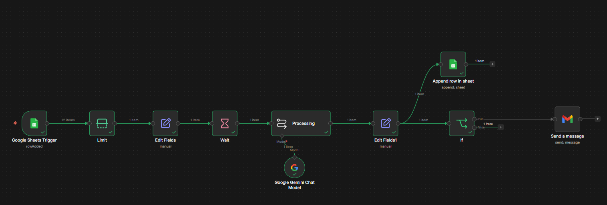
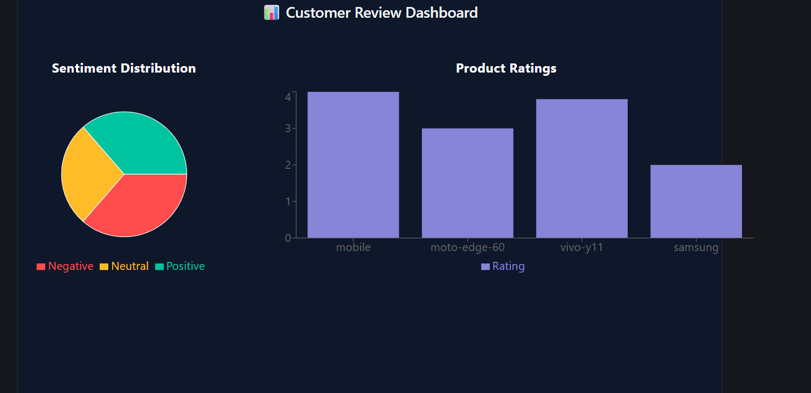
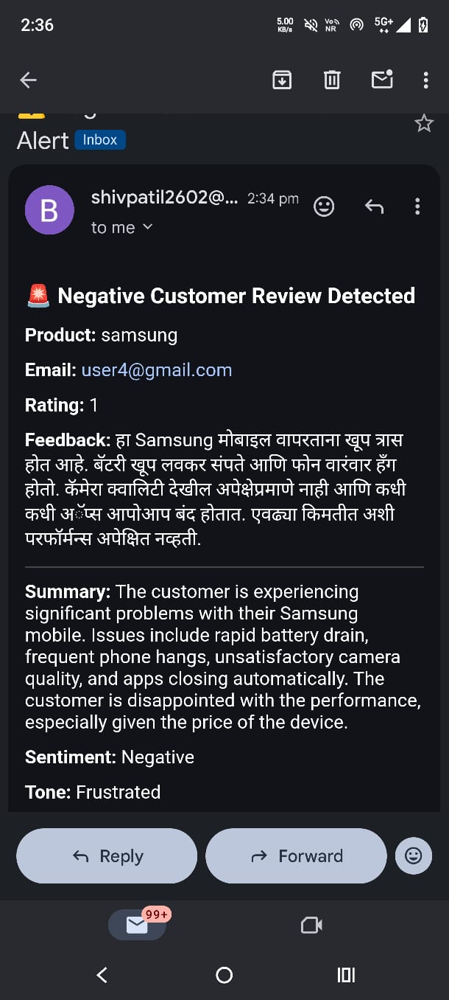
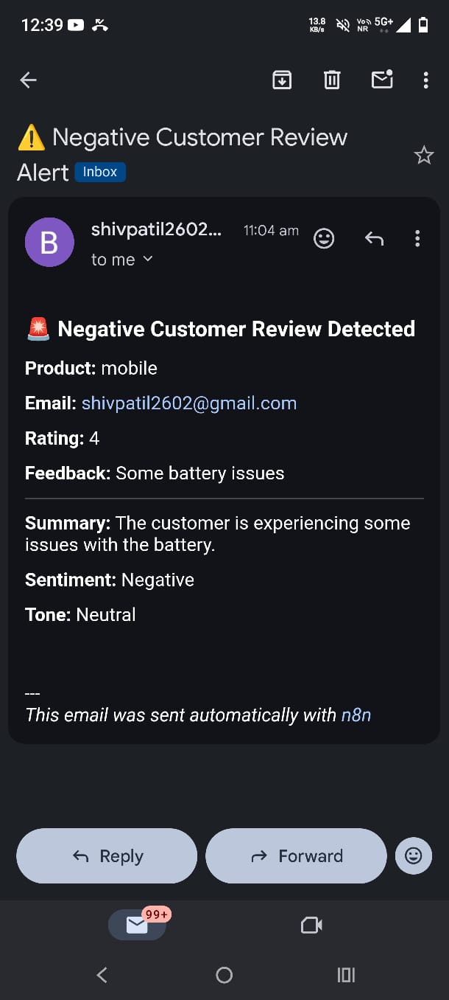

# 🚀 AI-Powered Customer Review Analysis & Alert System

An end-to-end intelligent system that automates the collection, analysis, and monitoring of customer reviews using AI, enabling real-time insights and proactive decision-making.

---

## 📌 Overview

This project captures customer feedback from Google Forms, processes it using AI models to extract meaningful insights (language, translation, summary, sentiment, tone), and triggers alerts for critical (negative) reviews. The processed data is stored and visualized through an interactive dashboard.

---

## ⚙️ Key Features

* 📥 **Automated Data Collection**
  Collects customer reviews via Google Forms and stores them in Google Sheets.

* 🧠 **AI-Based Analysis**
  Uses LLMs (Gemini/OpenAI) to:

  * Detect review language
  * Translate non-English reviews into English
  * Generate concise summaries
  * Detect sentiment (Positive / Neutral / Negative)
  * Classify tone (e.g., Frustrated, Satisfied)

* 🌍 **Multi-language Support**
  Automatically detects the language of the review and translates it into English, enabling global usability.

* 📊 **Sentiment Scoring System**
  Converts sentiment into numeric scores for analytics:

  * Positive → 0.8 – 1.0
  * Neutral → 0.4 – 0.7
  * Negative → 0.0 – 0.3

* 🚨 **Real-Time Alert System**
  Automatically sends email notifications for negative reviews.

* 📁 **Data Storage**
  Stores processed insights in structured Google Sheets, including:

  * Original Language
  * Translated Review
  * Summary
  * Sentiment
  * Tone
  * Sentiment Score

* 📈 **Interactive Dashboard**
  Built using React + Recharts:

  * Sentiment distribution (Pie Chart)
  * Product ratings (Bar Chart)

---

## 🏗️ System Architecture

```
Google Form → Google Sheets → n8n Workflow → AI Processing → Decision Engine → Alerts + Storage → Dashboard
```

---

## 🛠️ Tech Stack

### 🔹 Automation & Backend

* n8n (Workflow Automation)
* Google Sheets API
* Gmail API

### 🔹 AI / LLM

* Google Gemini API (or OpenAI)

### 🔹 Frontend Dashboard

* React (Vite)
* Axios
* Recharts

### 🔹 Deployment

* Vercel (Dashboard)

---

## 📂 Project Structure

```
ai-review-analysis/
│
├── dashboard/              # React dashboard (Vite)
├── n8n/
│   └── workflow.json       # Exported automation workflow
├── screenshots/            # UI and workflow images
├── README.md
└── .gitignore
```

---

## 🚀 Workflow Breakdown

### Phase 1 — Data Input

* Google Form collects:

  * Product
  * Email
  * Rating
  * Feedback

### Phase 2 — Trigger

* Google Sheets Trigger detects new entries

### Phase 3 — AI Processing

* Language detection
* Translation (if non-English)
* Summary generation
* Sentiment detection
* Tone classification

### Phase 4 — Data Storage

* Results appended to processed sheet

### Phase 5 — Decision Engine

* IF condition:

```
sentiment === "Negative"
```

### Phase 6 — Alert System

* Sends Gmail alert for critical reviews

### Phase 7 — Sentiment Scoring

* Converts text sentiment → numeric score

### Phase 8 — Visualization

* Dashboard displays insights

---

## 📊 Dashboard Features

* 📈 Sentiment Distribution (Pie Chart)
* 📊 Product Ratings (Bar Chart)
* 🌍 Display of multilingual processed data
* Real-time data fetched from Google Sheets API

---


## 🔧 Setup Instructions

### 1. Clone Repository

```
git clone https://github.com/your-username/ai-review-analysis.git
cd ai-review-analysis
```

### 2. Setup Dashboard

```
cd dashboard
npm install
npm run dev
```

### 3. Setup n8n

* Import `workflow.json`
* Configure credentials:

  * Google Sheets
  * Gmail
  * Gemini/OpenAI API

---

## 📸 Screenshots

### 🔄 n8n Workflow



---

### 📊 Dashboard UI



---

### 📧 Email Alert Example

<p align="center">
  
  
</p>

---

## 🌟 Key Highlights

* Fully automated AI pipeline
* Real-time event-driven architecture
* No manual intervention required
* Combines AI + Automation + Visualization
* 🌍 Supports multilingual customer feedback

---

## 📌 Use Cases

* Customer feedback monitoring
* Product quality analysis
* Early detection of user dissatisfaction
* Business intelligence dashboards

---

## 🚀 Future Enhancements

* Auto-reply generation
* Slack / WhatsApp alerts
* Advanced analytics dashboard
* Issue clustering using AI

---

## 👨‍💻 Author

**Balu Patil**
